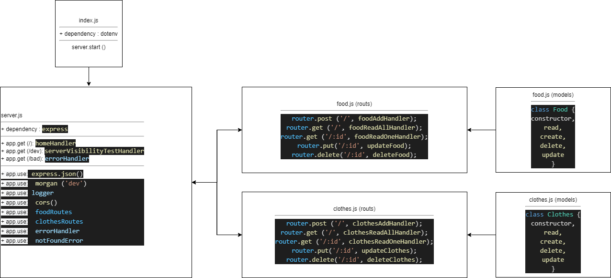

401 lab 03 Express REST API
# LAB - 03
## basic-api-server
### Author: Tamara Al-billeh

* [deployment for main branch ]() .
* [submission PR](https://github.com/tamaraalbilleh/basic-api-server/pulls) .
* [tests report](https://github.com/tamaraalbilleh/basic-api-server/actions) .
 
### Setup

#### `.env` requirements

- `PORT` - 5000

#### Running the app

- `npm start`
- Endpoint: `/`
  - Returns message

    ```

    'welcome to home page!';

    ```
- Endpoint: `/food`
  - Gets the food Objects stored

  ```

  {
    "id": "21dd7d1c-4bc1-4dd8-8677-9d0cd213d614",
    "data": {
        "name": "cake",
        "price": "10"
    },

    {
    "id": "21dd7d1c-4bc1-4dd8-8677-9d0cd213d614",
    "data": {
        "name": "candy",
        "price": "5"
    }
  }

  ```
- Endpoint: `/food/21dd7d1c-4bc1-4dd8-8677-9d0cd213d614`
  - Gets the food Objects stored according to id

  ```

  {
    "id": "21dd7d1c-4bc1-4dd8-8677-9d0cd213d614",
    "data": {
        "name": "cake",
        "price": "10"
    }

  }
  
  ```
- Endpoint: `/food/21dd7d1c-4bc1-4dd8-8677-9d0cd213d614`
  - Gets the food Objects stored and Updates it according to id
  > ```"name": "cheese cake","price": "10"  ```
  
  

  ```

  {
    "id": "21dd7d1c-4bc1-4dd8-8677-9d0cd213d614",
    "data": {
        "name": "cheese cake",
        "price": "10"
    }
  }

  ```
  - Endpoint: `/food/21dd7d1c-4bc1-4dd8-8677-9d0cd213d614`
  - Gets the food Objects stored and Deletes it according to id

  ```

  {
    {
    "id": "21dd7d1c-4bc1-4dd8-8677-9d0cd213d614",
    "data": {
        "name": "candy",
        "price": "5"
    }
  }

  ```
  - Endpoint: `/clothes`
  - Adds on the clothes Objects stored 

  ```

  {
    "id": "21dd7d1c-4bc1-4dd8-8677-9d0cd213d614",
    "data": {
        "name": "hat",
        "price": "10"
    },

    {
    "id": "21dd7d1c-4bc1-4dd8-8677-9d0cd213d614",
    "data": {
        "name": "scarf",
        "price": "5"
    },

    {
    "id": "21dd7d1c-4bc1-4dd8-8677-9d0cd213d614",
    "data": {
        "name": "pants",
        "price": "6"
    }
  }

  ```
- Endpoint: `/clothes`
  - Gets the clothes Objects stored

  ```

  {
    "id": "21dd7d1c-4bc1-4dd8-8677-9d0cd213d614",
    "data": {
        "name": "hat",
        "price": "10"
    },

    {
    "id": "21dd7d1c-4bc1-4dd8-8677-9d0cd213d614",
    "data": {
        "name": "scarf",
        "price": "5"
    }
  }

  ```
- Endpoint: `/clothes/21dd7d1c-4bc1-4dd8-8677-9d0cd213d614`
  - Gets the clothes Objects stored according to id

  ```

  {
    "id": "21dd7d1c-4bc1-4dd8-8677-9d0cd213d614",
    "data": {
        "name": "hat",
        "price": "10"
    }

  }
  
  ```
- Endpoint: `/clothes/21dd7d1c-4bc1-4dd8-8677-9d0cd213d614`
  - Gets the clothes Objects stored and Updates it according to id
  > ```"name": "socks","price": "10"  ```
  
  

  ```

  {
    "id": "21dd7d1c-4bc1-4dd8-8677-9d0cd213d614",
    "data": {
        "name": "socks",
        "price": "10"
    }
  }

  ```
  - Endpoint: `/clothes/21dd7d1c-4bc1-4dd8-8677-9d0cd213d614`
  - Gets the clothes Objects stored and Deletes it according to id

  ```

  {
    {
    "id": "21dd7d1c-4bc1-4dd8-8677-9d0cd213d614",
    "data": {
        "name": "scarf",
        "price": "5"
    }
  }

  ```
  - Endpoint: `/clothes`
  - Adds on the clothes Objects stored 

  ```

  {
    "id": "21dd7d1c-4bc1-4dd8-8677-9d0cd213d614",
    "data": {
        "name": "cake",
        "price": "10"
    },

    {
    "id": "21dd7d1c-4bc1-4dd8-8677-9d0cd213d614",
    "data": {
        "name": "candy",
        "price": "5"
    },

    {
    "id": "21dd7d1c-4bc1-4dd8-8677-9d0cd213d614",
    "data": {
        "name": "pants",
        "price": "6"
    }
  }

  ```
- Endpoint: `/bad`
  - Throws an error 500
  - Returns an Object

    ```

    {
        "status": 500,
        "message": "something went wrong ",
        "rout": "/bad",
    }

    ```
- Endpoint: **anything else ..**
  - Returns an error 404
  - Returns an Object

    ```

    {
        "status": 404,
        "message": "Sorry , Page not Found"
    }

    ```
#### Tests

- Unit Tests: `npm run test`
- Lint Tests: `npm run lint`

#### UML

(Created with [diagrams](https://app.diagrams.net/))

